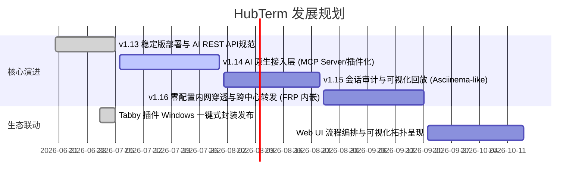

# HubTerm — 串口/SSH 集群管控平台 & AI 执行基础设施 Roadmap

## 🎯 定位
**AI 智能体的执行环境基础设施层** — 赋予 AI 发现物理/虚拟设备、认知接口与连接能力、自动寻路路由、以及跨节点安全执行复杂脚本的能力。

---

## 📈 阶段路线图 (2026-07-05 更新)

---

## 🚀 最新进度汇总

### 🟢 已完成 (近期更新)

| 模块/功能 | 详细说明 | 交付状态 |
| :--- | :--- | :--- |
| **Tabby 插件构建修复** | 修复了 Webpack 5 构建中由于 native `.node` 模块引起的语法解析崩溃，在云端流水线实现全自动集成构建。 | ✅ v1.13.2 |
| **Windows 一键式封装** | 打包 `install.cmd` 与说明，自动将编译插件解压写入用户的 `%APPDATA%/tabby/plugins` 目录。 | ✅ v1.13.2 |
| **1.55 远程一键部署** | 编写 `deploy-55.sh`。本地一键增量同步，在 1.55 服务器直接就地热编译重启，支持 `.git` 库同调，避免 `Text file busy` 错误。 | ✅ v1.13.3 |
| **快速发送（Quick Send）** | 在 Web 端终端交互中引入智能 Shebang 检测。针对 Python 或含有 `#!/bin/bash` 的长脚本，全自动在目标机生成 `/tmp/` 临时文件授权执行并完成销毁，防止终端粘滞与格式混乱。 | ✅ v1.13.3 |
| **预设脚本强制重置** | 支持在服务启动时自动根据 presets 磁盘内容覆盖数据库中旧同名脚本，让脚本修改立刻在系统层生效。 | ✅ v1.13.3 |
| **Git 追踪与过滤优化** | 将 `web/dist` 和 `tabby-hubterm-plugin/dist` 移出 Git 跟踪并在 `.gitignore` 中声明，规避了本地/远端重复编译冲突。 | ✅ v1.13.3 |
| **AI 接口对接规范** | 编写了 `docs/ai-integration.md`，提供设备发现、异步执行和脚本上传的 API 规范，以及大模型 Function Calling JSON Schema 模版。 | ✅ v1.13.3 |

---

## 🗺️ 未来核心方向规划

### 1. 🤖 AI 原生接入层 (MCP Server 协议集成) - P0 (7月规划)
*   **目标**：不再需要针对不同的 AI 平台硬编码 API JSON 模版，让主流 AI 直接将其作为“外挂工具箱”调用。
*   **规划**：
    *   在 Go 后端内嵌或独立编写一个轻量级 **MCP (Model Context Protocol) Server**。
    *   AI 助手通过标准 MCP 协议与 HubTerm Center 对接，实现毫秒级自动暴露 `hubterm_discover`、`hubterm_exec` 等工具函数。
    *   提供一套基于 Python 的 AI Agent 诊断侧车（Sidecar）样例程序。

### 2. 📹 终端审计与录像回放 (Asciinema 协议) - P1 (8月规划)
*   **目标**：由于 AI 代理拥有自主执行 shell 脚本的权利，必须拥有透明、可视化的执行过程审计审计机制。
*   **规划**：
    *   在 Center 端捕获并存储 Agent 的终端双向 I/O 流（采用 Asciinema 兼容格式）。
    *   在 Web 前端开发一个基于 `xterm.js` 的会话播放器，管理员可一键回放任何 AI 代理或人类操作员的实时终端命令行操作，支持进度条和倍速播放。

### 3. 🌐 零阻碍内网穿透 (内嵌 FRP/Zero-Trust 隧道) - P1 (8-9月规划)
*   **目标**：解决 Agent 处于严苛防火墙内部、Center 处于公网时，双向反向代理建立 SSH 或串口连接的连通性难题。
*   **规划**：
    *   摒弃复杂的外部 frp 运维，直接在 Go Center 和 Go Agent 内部使用 Lib 级别内嵌轻量级 NAT 穿透连接通道。
    *   Agent 启动时通过长连接全自动完成端口暴露与安全加密隧道建立，实现“零配置反向网络代理”。

### 4. 🎛️ 可视化编排与大屏拓扑 (Workflow & Topology) - P2 (9-10月规划)
*   **目标**：提供类似 Ansible/Gantt Chart 的多机器并发脚本执行流，以及自动呈现网络设备连接关系。
*   **规划**：
    *   **脚本编排流**：允许用户在 Web UI 配置带有逻辑分支的执行流（例如：若步骤 A 检测 CPU 失败，则分支执行 B 重启）。
    *   **拓扑可视化**：基于 Agent 收集的邻居信息（如 LLDP）或路由跳数，自动使用 D3.js/Vis.js 在前端画出节点与串口设备拓扑图。

---

## 🛠️ 技术栈演进建议
1.  **数据库**：对于大型集群（100+ 节点），未来考虑在 `config.yaml` 中支持除 SQLite 之外的 MySQL/PostgreSQL 驱动切换。
2.  **安全加密**：命令下发通道全面启用 TLS 双向认证（mTLS），防止在跨公网代理时命令遭到中间人拦截或篡改。
