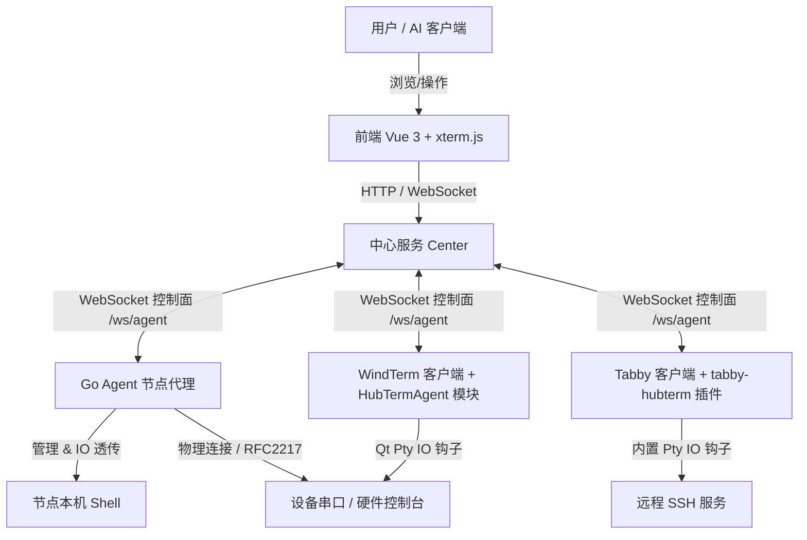
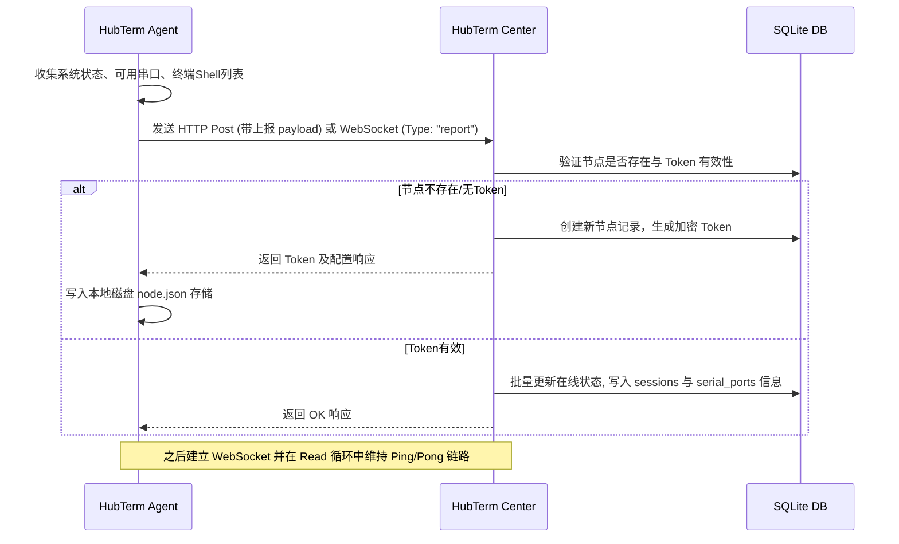
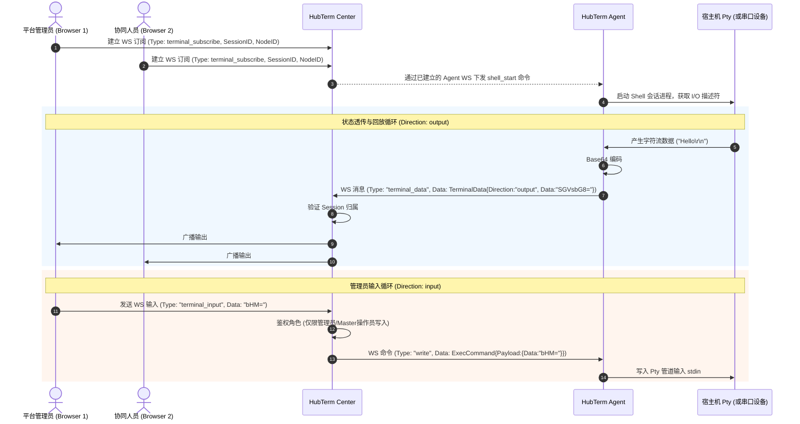

# HubTerm 架构与设计文档

本文档详细阐述 **HubTerm（串口/SSH 集群管控平台）** 的系统架构、核心组件设计、数据流向、通信协议及客户端集成方案。

---

## 1. 系统概述与核心目标

HubTerm 旨在通过**轻量集群方案**（节点状态/能力上报 + 中心管控，无强制流量中转），提供串口与 SSH 终端的集中化管理与审计。

### 核心功能
1. **统一设备抽象**：通过 `hubterm://device-name` 虚拟地址，将串口或 SSH 设备映射至统一命名空间。
2. **终端共享与协同**：支持单会话多用户接入，区分主控（Master）与观察者（Watcher）权限，实现实时会话演示或多人排障。
3. **批量命令与脚本分发**：支持将 Python/Shell 脚本一键分发至多个节点并行执行。
4. **安全审计与录制**：记录用户的所有输入输出以及操作审计日志，便于合规追踪。
5. **AI 辅助接口**：内置对 AI 的友好接口（支持标准指令解析、Python 执行沙箱和能力描述上报）。

---

## 2. 系统拓扑与数据/控制面分离

HubTerm 采用**控制面与数据面分离**的设计思想。



* **控制面（Control Plane）**：节点代理运行后，向中心服务主动上报节点特征和可用会话。中心分发管理指令（如踢除会话、分配权限、下发执行脚本等）。
* **数据面（Data Plane）**：终端 I/O 流使用 WebSocket 进行直连透传（Base64 编码）。无需经过重型 TCP 代理，只有在被显式订阅或触发全局审计时，中心才会将流量持久化或广播给订阅前端。

---

## 3. 项目结构与目录说明

代码仓主要划分为中心端、节点端、共享协议定义、以及两个终端客户端（Tabby/WindTerm）的集成部分：

* [cmd/center](file:///Volumes/codex/code/hubterm_project/hubterm/cmd/center) - 中心服务的启动入口。
* [cmd/agent](file:///Volumes/codex/code/hubterm_project/hubterm/cmd/agent) - Go Agent 服务的启动入口与 CLI 参数解析。
* [internal/center](file:///Volumes/codex/code/hubterm_project/hubterm/internal/center) - 中心端的业务逻辑，包括：
  * [internal/center/handler](file:///Volumes/codex/code/hubterm_project/hubterm/internal/center/handler) - API 控制器和 WebSocket 连接控制器。
  * [internal/center/model](file:///Volumes/codex/code/hubterm_project/hubterm/internal/center/model) - 数据库实体定义。
  * [internal/center/service](file:///Volumes/codex/code/hubterm_project/hubterm/internal/center/service) - 核心业务服务。
* [internal/agent](file:///Volumes/codex/code/hubterm_project/hubterm/internal/agent) - Agent 端的实现细节，包含设备指标采集器（collector）、WebSocket 连接器（connector）、自动发现（discovery）、命令执行器（executor）、本地 Shell 管理器（localshell）和状态定时上报器（reporter）。
* [internal/proto](file:///Volumes/codex/code/hubterm_project/hubterm/internal/proto) - 双方通信的强类型消息结构。
* [web](file:///Volumes/codex/code/hubterm_project/hubterm/web) - 前端 Vue 3 单页面应用。
* [tabby-hubterm-plugin](file:///Volumes/codex/code/hubterm_project/hubterm/tabby-hubterm-plugin) - Tabby 终端的 TypeScript 扩展插件源码。

---

## 4. 数据库模型设计

系统基于 SQLite 数据库进行数据持久化，通过 GORM 进行实体映射。以下为核心模型关系：

| 模型类 | 对应表名 | 描述 | 主要字段 |
|---|---|---|---|
| [User](file:///Volumes/codex/code/hubterm_project/hubterm/internal/center/model/models.go#L10) | `users` | 平台操作员账户 | `Username`, `PasswordHash`, `Role` (admin/operator/readonly) |
| [Node](file:///Volumes/codex/code/hubterm_project/hubterm/internal/center/model/models.go#L37) | `nodes` | 托管节点状态 | `NodeID`, `Name`, `IP`, `Status` (online/offline), `CPUPercent`, `MemoryPercent`, `Token` (安全鉴权) |
| [Device](file:///Volumes/codex/code/hubterm_project/hubterm/internal/center/model/device.go#L25) | `devices` | 具体的物理设备 | `DeviceID`, `Name`, `Type` (ap/switch/server), `NodeID` (所属节点), `Protocol` (serial/ssh), `PortName` |
| [SerialPort](file:///Volumes/codex/code/hubterm_project/hubterm/internal/center/model/models.go#L63) | `serial_ports` | 物理串口描述信息 | `NodeID`, `PortName`, `BaudRate`, `Status` (online/offline/busy) |
| [Session](file:///Volumes/codex/code/hubterm_project/hubterm/internal/center/model/models.go#L76) | `sessions` | 活动中的终端共享会话 | `SessionID`, `NodeID`, `PortName`, `User`, `Type` (master/watcher), `ClientIP` |
| [DeviceAlias](file:///Volumes/codex/code/hubterm_project/hubterm/internal/center/model/models.go#L100) | `device_aliases` | 虚拟设备别名映射 | `Alias` (hubterm://ap-03), `DeviceID`, `NodeID`, `Protocol` |
| [Script](file:///Volumes/codex/code/hubterm_project/hubterm/internal/center/model/script.go#L8) | `scripts` | Python 脚本库定义 | `ScriptID`, `Name`, `Language`, `Source` (源码文本), `Params` |
| [ScriptResult](file:///Volumes/codex/code/hubterm_project/hubterm/internal/center/model/script.go#L23) | `script_results` | 脚本分发执行的结果日志 | `ScriptID`, `NodeID`, `Stdout`, `Stderr`, `ExitCode`, `Status` |
| [AuditLog](file:///Volumes/codex/code/hubterm_project/hubterm/internal/center/model/models.go#L89) | `audit_logs` | 操作日志审计表 | `User`, `Action`, `Target`, `Detail`, `IP` |

---

## 5. 通信协议与安全鉴权

### 5.1 WebSocket 通信基座
所有数据包通过标准的 JSON 包装格式传递，对应 Go 结构体 [WSMessage](file:///Volumes/codex/code/hubterm_project/hubterm/internal/proto/types.go#L88)：
```json
{
  "type": "消息类型",
  "data": { ... 负载对象 ... }
}
```

### 5.2 鉴权与生命周期流程

1. **首次上报与注册**
   - 节点代理启动时（参见 [main](file:///Volumes/codex/code/hubterm_project/hubterm/cmd/agent/main.go#L67)），通过定时上报向 Center 发送注册请求 [RegisterMessage](file:///Volumes/codex/code/hubterm_project/hubterm/internal/proto/types.go#L153)。
   - Center 验证无误后，会为该节点签发并返回一个长效加密 Token 记录在数据库中。
   - 节点收到 Token 后，保存在本地 `node.json` 配置文件中，供后续认证使用。

2. **WebSocket 握手鉴权**
   - 节点代理（或终端插件）启动连接连接 Center 服务的 WebSocket 端点 `/api/ws/agent?node_id=...`。
   - 由于原生浏览器或客户端环境可能无法直接设置 Authorization Header，Center 支持两种鉴权手段：
     - **标准 Header 模式**：携带 `Authorization: Bearer <node_token>`。
     - **WebSocket 子协议模式**：在 Sec-WebSocket-Protocol 中传递 `hubterm.node.<node_token>` 标识。
   - 参见 [AgentWSHandler.HandleAgentWS](file:///Volumes/codex/code/hubterm_project/hubterm/internal/center/handler/agent_ws.go#L50) 对子协议进行解析。

---

## 6. 核心交互流程

### 6.1 注册、上报与心跳流程

定时任务每 3 秒触发一次。节点收集并上报资源信息，中心以此判断节点活性和更新设备列表：



### 6.2 终端数据流透传与共享终端 (SharedTerminal)

这是多人终端协同控制的核心链路。当管理员点击“共享终端”时：



---

## 7. 客户端集成实现细节

### 7.1 Tabby 插件设计 (`tabby-hubterm`)
* **核心拦截器**：[TerminalDecorator](file:///Volumes/codex/code/hubterm_project/hubterm/tabby-hubterm-plugin/src/terminalDecorator.ts)。通过挂载装饰器捕获 `output$` 和 `input$` 两个 RxJS 数据流。
* **安全性优化**：利用 `TextEncoder` 和 `Uint8Array` 规避 `btoa` 在转换多字节 Unicode（如中文）时的崩溃缺陷。
* **生命周期清理**：在页面离开或终端 Destroy 时，显式调用 `.unsubscribe()` 取消订阅，避免侦听器遗留引起内存泄漏及重复推送。
* 更多交接细节参见：[Tabby 进度文档](file:///Volumes/codex/code/hubterm_project/hubterm/docs/windterm-tabby-progress-2026-06-20.md)。

### 7.2 WindTerm 改造方案 (`HubTermAgent`)
* **C++ Qt 主入口**：`HubTermAgent` 管理连接重试定时器和命令执行。
* **信号钩子 hook**：通过拦截 `readyRead` 信号，在数据投递到 GUI 渲染层前读取 Pty 并转译发送给 Center。
* 更多方案设计参见：[WindTerm 改造方案](file:///Volumes/codex/code/hubterm_project/hubterm/docs/windterm-hubterm-integration.md)。

---

## 8. 运维部署要点

### 8.1 容器部署
中心端支持采用 Docker 容器一键交付。配置文件模板详见 [docker-compose.yml](file:///Volumes/codex/code/hubterm_project/hubterm/docker-compose.yml)：
* 依赖的 SQLite 数据库 `hubterm.db` 推荐使用卷挂载进行持久化备份。
* 必须在环境变量中提供固定的 `JWT_SECRET`，否则将生成临时密钥导致重启后操作员 Token 失效。

### 8.2 系统服务化
节点代理支持通过参数一键注册为系统服务（参见 Go 服务安装函数 [service.Install](file:///Volumes/codex/code/hubterm_project/hubterm/internal/agent/service/service.go#L16)）：
```bash
# 自动探测系统并生成 systemd 单元/launchd plist / SC 服务定义，开机常驻运行
./hubterm-agent --center http://10.0.0.1:8080 --install
```
